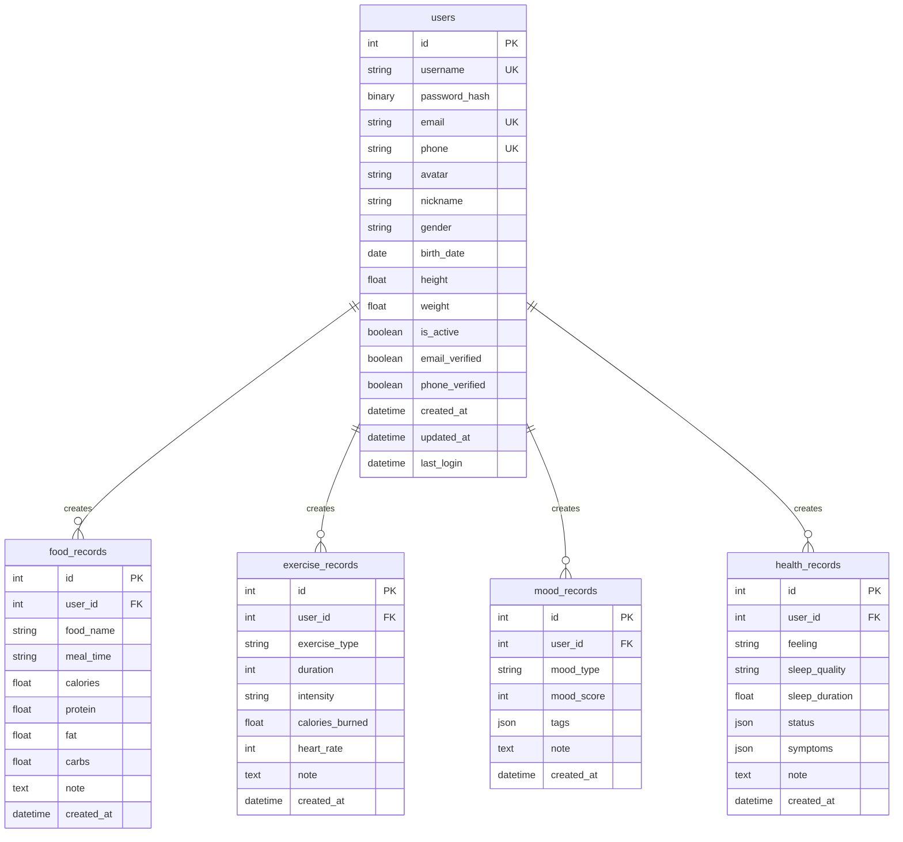

# 健康管理系统数据库设计

## 1. 数据库概述

本系统使用MySQL数据库，采用UTF-8编码，支持中文存储。

### 1.1 数据库信息
- 数据库名：health_system
- 字符集：utf8mb4
- 排序规则：utf8mb4_unicode_ci

## 2. 表结构设计

### 2.1 用户表 (users)

| 字段名 | 类型 | 长度 | 允许空 | 默认值 | 说明 |
|--------|------|------|--------|--------|------|
| id | INT | - | 否 | AUTO_INCREMENT | 主键 |
| username | VARCHAR | 80 | 否 | - | 用户名，唯一 |
| password_hash | BINARY | 60 | 否 | - | 密码哈希 |
| email | VARCHAR | 120 | 是 | NULL | 邮箱，唯一 |
| phone | VARCHAR | 20 | 是 | NULL | 手机号，唯一 |
| avatar | VARCHAR | 200 | 是 | NULL | 头像URL |
| nickname | VARCHAR | 80 | 是 | NULL | 昵称 |
| gender | VARCHAR | 10 | 是 | NULL | 性别 |
| birth_date | DATE | - | 是 | NULL | 出生日期 |
| height | FLOAT | - | 是 | NULL | 身高(cm) |
| weight | FLOAT | - | 是 | NULL | 体重(kg) |
| is_active | BOOLEAN | - | 否 | TRUE | 账号状态 |
| email_verified | BOOLEAN | - | 否 | FALSE | 邮箱验证状态 |
| phone_verified | BOOLEAN | - | 否 | FALSE | 手机验证状态 |
| created_at | DATETIME | - | 否 | CURRENT_TIMESTAMP | 创建时间 |
| updated_at | DATETIME | - | 否 | CURRENT_TIMESTAMP | 更新时间 |
| last_login | DATETIME | - | 是 | NULL | 最后登录时间 |

索引：
- PRIMARY KEY (id)
- UNIQUE KEY (username)
- UNIQUE KEY (email)
- UNIQUE KEY (phone)

### 2.2 食物记录表 (food_records)

| 字段名 | 类型 | 长度 | 允许空 | 默认值 | 说明 |
|--------|------|------|--------|--------|------|
| id | INT | - | 否 | AUTO_INCREMENT | 主键 |
| user_id | INT | - | 否 | - | 用户ID |
| food_name | VARCHAR | 100 | 否 | - | 食物名称 |
| meal_time | VARCHAR | 20 | 否 | - | 用餐时间类型 |
| calories | FLOAT | - | 是 | NULL | 卡路里 |
| protein | FLOAT | - | 是 | NULL | 蛋白质(g) |
| fat | FLOAT | - | 是 | NULL | 脂肪(g) |
| carbs | FLOAT | - | 是 | NULL | 碳水化合物(g) |
| note | TEXT | - | 是 | NULL | 备注 |
| created_at | DATETIME | - | 否 | CURRENT_TIMESTAMP | 创建时间 |

索引：
- PRIMARY KEY (id)
- FOREIGN KEY (user_id) REFERENCES users(id)
- INDEX (created_at)

### 2.3 运动记录表 (exercise_records)

| 字段名 | 类型 | 长度 | 允许空 | 默认值 | 说明 |
|--------|------|------|--------|--------|------|
| id | INT | - | 否 | AUTO_INCREMENT | 主键 |
| user_id | INT | - | 否 | - | 用户ID |
| exercise_type | VARCHAR | 50 | 否 | - | 运动类型 |
| duration | INT | - | 否 | - | 时长(分钟) |
| intensity | VARCHAR | 20 | 否 | - | 运动强度 |
| calories_burned | FLOAT | - | 是 | NULL | 消耗卡路里 |
| heart_rate | INT | - | 是 | NULL | 心率 |
| note | TEXT | - | 是 | NULL | 备注 |
| created_at | DATETIME | - | 否 | CURRENT_TIMESTAMP | 创建时间 |

索引：
- PRIMARY KEY (id)
- FOREIGN KEY (user_id) REFERENCES users(id)
- INDEX (created_at)

### 2.4 心情记录表 (mood_records)

| 字段名 | 类型 | 长度 | 允许空 | 默认值 | 说明 |
|--------|------|------|--------|--------|------|
| id | INT | - | 否 | AUTO_INCREMENT | 主键 |
| user_id | INT | - | 否 | - | 用户ID |
| mood_type | VARCHAR | 20 | 否 | - | 心情类型 |
| mood_score | INT | - | 否 | - | 心情评分(1-5) |
| tags | JSON | - | 是 | NULL | 情绪标签 |
| note | TEXT | - | 是 | NULL | 备注 |
| created_at | DATETIME | - | 否 | CURRENT_TIMESTAMP | 创建时间 |

索引：
- PRIMARY KEY (id)
- FOREIGN KEY (user_id) REFERENCES users(id)
- INDEX (created_at)

### 2.5 健康记录表 (health_records)

| 字段名 | 类型 | 长度 | 允许空 | 默认值 | 说明 |
|--------|------|------|--------|--------|------|
| id | INT | - | 否 | AUTO_INCREMENT | 主键 |
| user_id | INT | - | 否 | - | 用户ID |
| feeling | VARCHAR | 20 | 否 | - | 身体感觉 |
| sleep_quality | VARCHAR | 20 | 是 | NULL | 睡眠质量 |
| sleep_duration | FLOAT | - | 是 | NULL | 睡眠时长(小时) |
| status | JSON | - | 是 | NULL | 健康状态标签 |
| symptoms | JSON | - | 是 | NULL | 症状标签 |
| note | TEXT | - | 是 | NULL | 备注 |
| created_at | DATETIME | - | 否 | CURRENT_TIMESTAMP | 创建时间 |

索引：
- PRIMARY KEY (id)
- FOREIGN KEY (user_id) REFERENCES users(id)
- INDEX (created_at)

## 3. 数据库关系图

## 4. 数据库维护

### 4.1 备份策略
- 每日全量备份
- 实时binlog备份
- 保留最近30天的备份

### 4.2 优化建议
- 定期ANALYZE TABLE
- 监控慢查询
- 适时优化索引
- 定期清理过期数据

### 4.3 安全建议
- 最小权限原则
- 定期更改密码
- 加密敏感信息
- 监控异常访问 